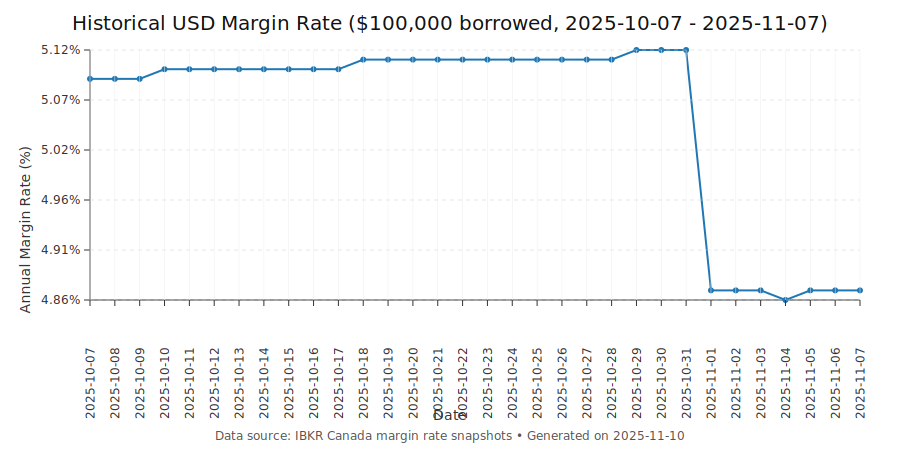

<!-- Generated from README.md.jinja; do not edit directly. -->

# ibkr-canada-rates

This repository contains the daily IBKR Canada interest and margin rates, with the latest snapshots available in [`data/2025/11/07/ibkr-canada-interest-rates.csv`](data/2025/11/07/ibkr-canada-interest-rates.csv) and [`data/2025/11/07/ibkr-canada-margin-rates.csv`](data/2025/11/07/ibkr-canada-margin-rates.csv).

The data is updated daily at 6AM EST.

## Usage

Run the Python updater to download the latest HTML pages, parse them, and
write CSV snapshots into `data/<YYYY>/<MM>/<DD>`. The project uses a `src`
layout, so set `PYTHONPATH` accordingly before invoking the module:

```
PYTHONPATH=src python -m ibkr_rates.update --output-dir data
```

For development or testing you can point the updater at local HTML copies
instead of fetching from the network:

```
PYTHONPATH=src python -m ibkr_rates.update \
    --output-dir data \
    --interest-html tests/interest-rates.html \
    --margin-html tests/margin-rates.html
```

## Automation

The scheduled GitHub Actions workflow runs the updater daily and pushes the
resulting CSV snapshots directly to the default branch. When the workflow runs
for a pull request it creates a temporary branch named `auto-update/<run-id>`
and pushes the generated data there so reviewers can inspect the diff without
affecting the base branch.

## Testing

```
pytest
```

## Historical USD margin rate snapshot

<p align="center">
  
</p>

# Disclaimer

This repository is for educational and informational purposes only. The data is scraped from publicly available IBKR Canada web pages and may contain errors or be outdated. I am not affiliated with Interactive Brokers or IBKR Canada in any way. Users should verify all rates directly with IBKR Canada before making any financial decisions. I disclaim all responsibility for the accuracy, completeness, or reliability of this data.

